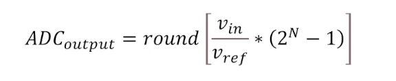

A maioria dos sinais encontrados na engenharia são sinais analógicos. A conversão AD basicamente transforma os sinais que nós temos na vida real em sinais digitais.

-  Um exemplo de aplicação digitalização de áudio e vídeo.

O STM32 possui três conversores **ADC**, **ADC1**, **ADC2** e o **ADC3**. Todos eles estão ligados ao barramento **APB2**, esse barramento opera com uma velocidade de clock de até **84 MHz**.

De forma simples, um ADC é um circuito capaz de gerar uma representação digital binaria de uma tensão analógica de entrada.

<div align="center"></div>

Para o STM32 a faixa de tensão permitida varia de 0V até 3.3V. ~={red}Dessa forma, o STM pode receber até no máximo 3.3V (porém, pode fornecer tensões de até 5V pelos pinos indicados).
=~
-  N - quantidade de bits da conversão (os bits da saída) - 12 bits;
-  2^N - quantidade de códigos digitalizáveis (números possíveis de serem codificados de 0 até 2^N -1) - 4096 códigos;
-  Resolução = (faixa de tensão de entrada) / (2^N - 1) - (805 microV).

A imagem abaixo representa uma escala comparando o valor de tensão de entrada à um código binário, as subdivisões na escala de código são as resoluções.

<div align="center"></div>

A relação entre a tensão de entrada e o código de saída no STM32F407 é sempre linear dentro dos limites de operação. 

> ~={green}Fórmula=~

<div align="center"></div>

-  Saturação do conversor - ocorre quando fornecemos uma tensão maior do que a tensão de referência (no nosso caso 3.3V) - a saída é limitada ao código máximo.
-  Devemos evitar fornecer tensões maiores que as de referência para que o conversor não seja danificado.

Existem diversas formas de implementar um conversor AD.

-  Paralelo - Flash;
-  \*Aproximações sucessivas (usado no STM32);
-  Tipo contador;
-  Integrador simples e dupla rampa;
-  Redistribuição de cargas;
-  Sigma-Delta.

<div align="center"></div>
*Exemplo - implementação por aproximações sucessivas.*

<div align="center"></div>

-  Exemplo com o conversor durante o armazenamento e a conversão do dado;
-  Inicialmente o capacitar é carregado com a tensão de entrada e ela se mantém constante ao longo do procedimento;
-  Após isso o próximo passo é fazer a comparação no bloco de controle.

> ~={green}Ok, mas e no STM32? 

Como vimos antes, o STM32 tem três conversores AD de aproximações sucessivas e com resolução de 12 bits. Vamos ver o diagrama de blocos de cada ADC.

<div align="center"></div>

-  Cada ADC tem 19 canais de entrada multiplexados, de **ADCIN_0** até **ADCIN_18**. Isso possibilita que cada um dos ADCs possa medir sinais de 16 fontes externas (pinos **GPIO**), 2 fontes internas e o canal **VBAT** que é usado para conexões com batéria. 
-  A tensão em cada entrada pode variar de 0 até 3.3V.

<mark style="background: #FF5582A6;">Obs</mark>

Apesar do conversor ter resolução de 12 bits, nós podemos configurar para reduzir a resolução por meio dos bits **RES** no registrador **CR1**, **CR2** ou **CR3** do módulo **ADC**.

<div align="center"></div>

A resolução pode ser de: 12, 10, 8 ou até 6 bits. Sendo assim, uma vez que a resolução diminui, o tempo de conversão diminui e a necessidade de memória também.

-  Os dados digitalizados são armazendos no registrador **DR**;
-  O final da conversão é indicado pelo bit **EOC** (End of Convertion) no registrador **SR** (Status Register) do módulo ADC.

<div align="center"></div>

-  O registrador de controle **CCRx** (com x sendo 1, 2 ou 3 a depender do canal) possibilita que nós possamos habilitar uma interrupção no final da conversão.
-  Os registradores de amostragem **SMPR1/SMPR2** possibilitam que nós possamos escolher o tempo de amostragem de cada canal;
-  O disparo de inicio de conversão pode ser feito por software ou sinais externos que vem de temporizadores internos ou outros pinos do microcontrolador;
-  Para que o ADC funcione corretamente ele precisa de dois sinais de clock:
	-  O clock que acessa os registradores (APB2) - pode ser habilitado individualmente para cada ADC pelos bits **ADC1EN**, **ADC2EN** ou **ADC3EN** pelo **RCC_APB2ENR**;
	-  O outro clock é o clock para o circuito analógico de aproximações sucessivas (**ADCCLK**), ele é comum a todos os ADC e ele é basicamente o clock APB2 dividido por um prescaler programável pelo bits **ADCPRE** do **CCR**. O valor máximo para esse clock é de **36 MHz**.

<div align="center"></div>

-  O circuito do ADC é ligado configurando o bit **ADON** do registrador **CR2**
-  A conversão inicia quando o bit **SWSTART** é setado.

###### <span style="color:rgb(4, 255, 0)">Modos de Conversão do ADC.</span> 

<div align="center"></div>

> ~={green}Primeiro modo - Conversão Simples=~

-  Conversão simples de um único canal;
-  O canal escolhido é selecionado pelos bits **SQ1** do registrador **SQR3**;

<div align="center"></div>

-  O resultado da conversão é armazenado no registrador DR;
-  Após a conversão, a flag EOC no SR é setada;
-  O conversor pode gerar uma solicitação de interrupção se o bit EOCIE em CR1 estiver setado (nesse modo, após o disparo da conversão o canal selecionado é convertido uma vez e o conversor fica aguardando um novo disparo).

> ~={green}Segundo modo - Conversão Contínua=~

-  Nesse modo o conversor inicia uma conversão imediatamente após concluir uma anterior;
-  Só é necessário o primeiro disparo;
-  Para usar esse modo o bit **CONT** do registrador **CR2** deve ser setado;

> ~={green}Terceito modo - Escaneamento=~

-  Para usar esse modo o bit **SCAN** do **CR1** deve ser setado.
-  O modo de escaneamento o conversor pode converter uma lista predefinida de canais;
-  Depois de um disparo, esse modo converte em ordem predefinida a quantidade e os canais especificados nos registradores de sequência: SQR1, SQR2 e SQR3;
-  O resultado de cada conversão é armazenado no DR (ocorre sobreescrita);
-  Também pode gerar interrupção se EOCIE estiver setado;
-  A conversão para quando o último valor da lista for convertido;

> ~={green}Quarto modo - Escaneamento Contínuo=~

-  Só a necessidade de um sinal de disparo;
-  Múltiplos canais;
-  O ADC inicia uma nova sequência de canais após o final de uma "lista" de conversões;
-  Os bits CONT e SCAN deve ser setados.

---

Falamos anteriormente que a resolução pode ser diminuida para até 6 bits. Entretanto, o registrador que armazena o resultado possui todos os 32 bits. Para fazer o ajuste de alinhamento do dado com o registrador de 32 bits nos devemos usar o bit **ALIGN** do CR2. (O alinhamento pode ser feito tanto à direita, quanto à esquerda).

> ~={green}Pinos e canais do STM32=~

<div align="center"></div>

-  Por exemplo, o pino PA1 é a entrada 1 para os canais 1, 2 e 3, ou seja, esse pino pode ser lido pelo canal um de qualquer um dos três ADCs.
-  Para usar qualquer um desses pinos como entrada dos conversores nós devemos configurar o pino com função analógica.

> ~={green}Exemplo 1=~

<div align="center"></div>

Nesse exemplo nós vamos usar um potenciômetro para fornecer um sinal analógico (de entrada) em PA0, que vai funcionar como canal 0 do conversor ADC1.

Quando giramos o eixo do potenciômetro no sentido horário ou anti-horário a tensão vária, aumenta ou diminui (pino central). A tensão será aplicada no pino PA0 para testar o conversor ADC.

-  O pinos PA0 vai receber o sinal do potenciômetro (entrada analógica);
-  Disparando conversão do valor a cada 1 segundos;
-  Fazer a leitura do valor convertido no registrador DR;
-  Printar o valor no Termite usando printf.

		Ajustando o Prescaler do Clock do ADC1

<div align="center"></div>

		Definindo a quantidade de canais que desejo converter usando os bits L (length) do SQR1

<div align="center"></div>

		Definindo o tempo de amostragem (ciclos de clock) 

<div align="center"></div>

> ~={green}Código=~

```C
#include "main.h"
#include "Utility.h"
#include <stdio.h>

void setup(){
	
	Utility_Init();
	USART1_Init();
	// Habilita o clock do GPIOA
	GPIO_Clock_Enable(GPIOA);
	// Pino PA0 como entrada analógica
	GPIO_Pin_Mode(GPIOA, PIN_0, ANALOG);
	// Configuração do ADC
	// Liga o Clock da Interface digital do ADC1
	RCC->APB2ENR |= RCC_APB2ENR_ADC1EN;
	// Seleciona o PRESCALER de 4 - 21 MHz (ADCPRE)
	ADC->CCR |= 0b01 << 16;
	// Seleciona a conversão de um único canal
	ADC1->SQR1 &= (0xF << 20);
	// Seleciona o canal que vai ser convertido
	ADC1->SQR3 &= ~(0x1F);
	// Seleciona o tempo de amostragem
	ADC1->SMPR2 |= 0b111;
	// Liga o conversor
	ADC1->CR2 |= ADC_CR2_ADON;

}

int main(){
	
	setup();
	
	while(1){
		
		// Inicia a conversão
		ADC1->CR2 |= ADC_CR2_SWSTART;
		// Aguarda o fim da conversão
		while (!(ADC1->SR & ADC_SR_EOC));
		// Faz a leitura do valor convertido
		uint16_t leitura = ADC1->DR;
		printf("Valor convertido %d\n", leitura);
		Delay_ms(1000);
	}
	return 0;
}
```

> ~={green}Usando a biblioteca HAL=~

```C
while (1){
	HAL_ADC_Start(&hadc1); // gatilha a conversão no ADC1
	HAL_ADC_PollForConversion(&hadc1, 10); // espera a conversão concluir e esperamos durante 10 milisegundos
	uint16_t leitura = HAL_ADC_GetValue(&hadc1); // faz a leitura

	printf("Valor convertido: %d\n", leitura);
	Delay_ms(1000);
}
```