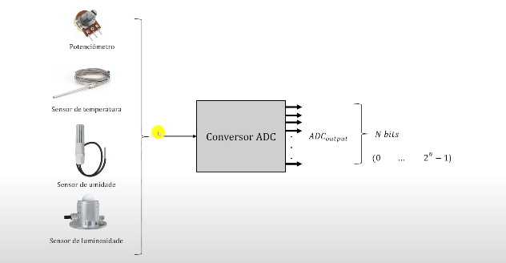

Nesta aula vamos continuar os estudos das aplicações do conversor ADC fazendo a leitura de múltiplos canais, inclusive usando interrupções.

> ~={green}Exemplo Prático 1=~

Nesse exemplo vamos fazer a leitura de múltiplos canais.

<div align="center"></div>

-  O exemplo apresenta dois potenciômetros que fornecem tensões analógicas aos pinos PA0 e PA1;
-  Esses pinos vão ser configurados para serem as entradas IN0 e IN1 do ADC1;
-  Vamos fazer a leitura dessas conversões e printar com printf.

> ~={green}Função de Setup=~

```C
void setup(){
	
	Utility_Init();
	USART1_Init();
	  
	// Habilita o clock do GPIOA
	GPIO_Clock_Enable(GPIOA);
	// Pino PA0 e PA1 como entrada analógica
	GPIO_Pin_Mode(GPIOA, PIN_0, ANALOG);
	GPIO_Pin_Mode(GPIOA, PIN_1, ANALOG);
	  
	// Configuração do ADC
	// Liga o Clock da Interface digital do ADC1
	RCC->APB2ENR |= RCC_APB2ENR_ADC1EN;
	// Seleciona o PRESCALER de 4 - 21 MHz (ADCPRE)
	ADC->CCR |= 0b01 << 16;
	// Seleciona a conversão para os canais IN0 e IN1 (PA0 e PA1)
	ADC1->SQR3 = (1 << 5) | (0 << 0);
	// Habilita o modo Scan (lista com todos os canais)
	ADC1->CR1 |= ADC_CR1_SCAN;
	// Habilita o sinal EOC ao fim de cada conversão
	ADC1->CR2 |= ADC_CR2_EOCS;
	// Liga o conversor ADC1
	ADC1->CR2 |= ADC_CR2_ADON;
	  
	// Usando a biblioteca Utility
	// Informa qual ADC vai ser usado, modo de operação e a resolução
	// ADC_Init(ADC1, SINGLE_CHANNEL, ADC_RES_12BITS);
	// A função de canal simples recebe o ADC que vai ser usado e o canal
	// ADC_Single_Channel(ADC1, ADC_IN0);
}
```

<mark style="background: #FF5582A6;">Obs</mark>

Os registradores SQR1, SQR2 e SQR3 armazenam as ordens de conversão, por isso em cima nós definimos (1 << 5) | (0 << 0). O primeiro valor a ser convertido é do canal 0 (escrito de 0 até 4) e o segundo valor a ser convertido é do canal 1 (escrito de 5 até 9).

<mark style="background: #FF5582A6;">Obs 2</mark>

Se EOCS for 0 ele só irá indicar o fim da conversão após converter os dois canais. Se for um 1 ele indica a cada conversão.

>~={green} Código completo usando os dois potenciômetros=~

```C
#include "main.h"
#include "Utility.h"
#include <stdio.h>

void setup(){
	Utility_Init();
	USART1_Init();
	
	// Habilita o clock do GPIOA
	GPIO_Clock_Enable(GPIOA);
	// Pino PA0 e PA1 como entrada analógica
	GPIO_Pin_Mode(GPIOA, PIN_0, ANALOG);
	GPIO_Pin_Mode(GPIOA, PIN_1, ANALOG);
	// Configuração do ADC
	// Liga o Clock da Interface digital do ADC1
	RCC->APB2ENR |= RCC_APB2ENR_ADC1EN;
	// Seleciona o PRESCALER de 4 - 21 MHz (ADCPRE)
	ADC->CCR |= 0b01 << 16;
	// Seleciona a conversão para os canais IN0 e IN1 (PA0 e PA1)
	ADC1->SQR3 = (1 << 5) | (0 << 0);
	// Habilita o modo Scan (lista com todos os canais)
	ADC1->CR1 |= ADC_CR1_SCAN;
	// Habilita o sinal EOC ao fim de cada conversão
	ADC1->CR2 |= ADC_CR2_EOCS;
	// Liga o conversor AD
	ADC1->CR2 |= ADC_CR2_ADON;
}

int main(){
	// Usando a biblioteca Utility
	// ADC_Init(ADC1, MULTI_CHANNEL, ADC_RES_12BITS);
	// uint8_t canais[2] = {ADC_IN0, ADC_IN1};
	// ADC_MultiChannel(ADC1, 2, canais);
	  
	setup();
		while(1){
		
		ADC1->CR1 |= ADC_CR2_SWSTART; // Inicia a conversão
		while(!(ADC1->SR & ADC_SR_EOC)); // Aguarda o fim da primeira conversão
		uint16_t canal0 = ADC1->DR; // Faz a leitura do valor convertido
		while(!(ADC1->SR & ADC_SR_EOC)); // Aguarda o fim da segunda conversão
		uint16_t canal1 = ADC1->DR; // Faz a leitura do valor convertido
		printf("Valor PA0 = %d\nValor PA1 = %d\n", canal0, canal1);
		Delay_ms(500);
		
		// Usando a biblioteca utility
		// uint16_t = leitura[2];
		
		// O ADC que vai ser usado, a quantidade de canais e onde vão ser armazenados
		// os valores lidos
		// ADC_GetMultiConversions(ADC1, 2, leitura);
		
		// printf("Valor PA0 = %d\nValor PA1 = %d\n", leitura[0], leitura[1]);
		// Delay_ms(500);
		
	}
	return 0;
}
```

---

Ok, mas vamos entender um pouco mais sobre o valor que obtemos após a conversão de sinais analógicos.

Bem, o resultado da conversão do sinal analógico está sempre compreendido entre **0 e 2^N - 1**, com **N** sendo a quantidade de bits do conversor **ADC** que nesse caso é 12. Sendo assim, os valores digitais possíveis são de 0 até 4095.

<div align="center"></div>

<div align="center">Só que tem um problema !!!!</div>

O valor obtido não expressa o valor real da grandeza que está sendo medida pelo sensor. 

Para resolver isso, nós precisamos determinar uma relação entre os valores resultantes da conversão (que são sempre a mesma faixa) e os valores reais das grandezas medidas.

> ~={green}Ok, mas como fazer isso?=~

Bem, para resolver esse problema nós devemos fazer o que chamamos de *escalonamento de grandezas*. 

<div align="center"></div>

-  A tensão de entrada do conversor (a que o STM vai receber) pode variar de 0 até 3.3 volts;
-  A quantidade de códigos possíveis usando uma resolução de 12 bits é de 4096 códigos de 0 até 4095.

> ~={green}Exemplo do Potenciômetro=~

<div align="center"></div>

Pela fórmula da imagem nós conseguimos calcular ao invés da saída do conversor, o valor de tensão. 

> ~={green}Código=~

```C
int main(){
	
	Utility_Init();
	USART1_Init();
	
	ADC_Init(ADC1, SINGLE_CHANNEL, ADC_RES_12BITS);
	ADC_SingleChannel(ADC1, ADC_IN0);
	
	while(1){
		uint16_t leitura = ADC_GetSingleConversion(ADC1);
		float voltage = 3.3 * (float) leitura/4095;
		
		printf("Voltage = %.2f\n\n", voltage); // Imprime o valor convertido no monitor
		Delay_ms(500);
	}
	return 0;
}
```

Para conseguir imprimir em ponto fluatuante eu devo seguir a seguinte configuração no STMCubeIDE

-  Menu Projects
-  Properties
-  C/C++ Build
-  Settings
-  Tool Settings
-  MCU/MPU GCC Linker
-  Miscellaneous
-  Other Flags 
- -- Adiciono a flag "-u \_printf\_float" 

Supondo que ao invés de um potenciômetro estejamos trabalhando com um sensor de temperatura que tem a tensão de 0V até 3.3V

> ~={green}Exemplo 3=~

<div align="center"></div>

```C
while(1){
	uint16_t leitura = ADC_GetSingleConversion(ADC1);
	float temperatura = (100*(float)leitura/4095)-20;
	
	printf("Temperatura = %.2f\n\n", temperatura);
	Delay_ms(500);
}
```

###### <span style="color:rgb(4, 255, 0)">Interrupções</span>

O tempo total da conversão é o tempo de amostra com o tempo de conversão. Durante esse procedimento o microcontrolador pode realizar outras tarefas e executar outras instruções. Para aproveitar melhor o desempenho do processador, podemos habilitar interrupção do ADC por conclusão de conversão. 
Dessa forma, o microcontrolador pode gatilhar uma conversão e ficar realizando outras tarefas enquanto a conversão não concluir. 
Quando a conversão for concluída uma interrupção é gerada uma ISR vai ser chamada e dentro da rotina podemos fazer a leitura do valor convertido.

```C
int main(){
	Utility_Init();
	USART1_Init();
	
	ADC_Init(ADC1, SINGLE_CHANNEL, ADC_RES_12BITS);
	ADC_SingleChannel(ADC1, ADC_IN0);
	
	// Habilita a interrupção em EOC
	ADC1->CR1 |= ADC_CR1_EOCIE; 
	// Habilita a interrupção do ADC no NVIC
	NVIC_EnableIRQ(ADC_IRQn);
	
	while(1){
		
		// Inicia a conversão
		ADC1->CR2 |= ADC_CR2_SWSTART;
		// Aguarda 500ms para fazer a nova leitura
		Delay_ms(1000);
	}
	return 0;
}


void ADC_IRQHandler(void){
	// Leitura e print da temperatura
	printf("Temperatura = %.2f\n\n", (100*(float)(ADC1->DR)/4095)-20);
	// Quando eu faço a leitura de DR a flag de pendência já é limpa
}
```


