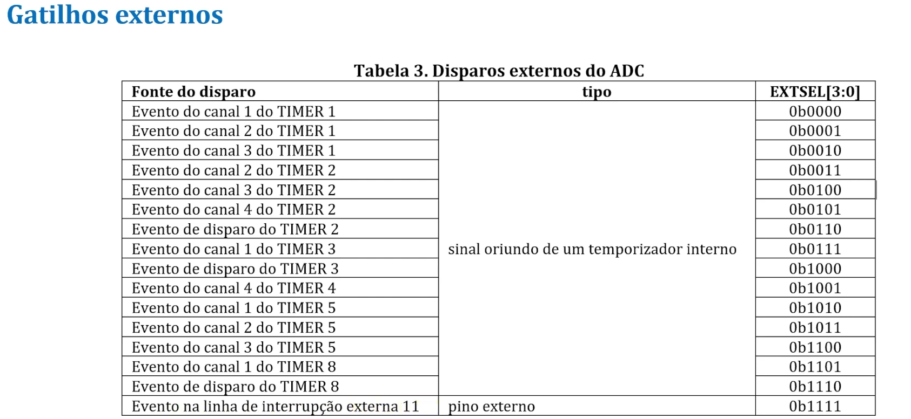
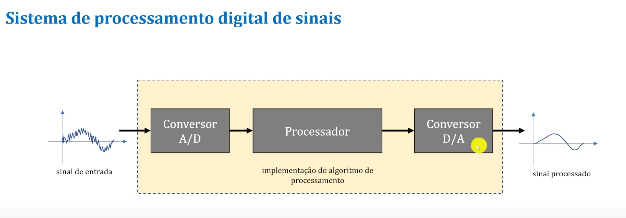

Nessa aula nós vamos ver como usar o sensor de temperatura do STM32 fazendo a leitura com o ADC. Alem disso, vamos ver um recurso de monitoramento do ADC chamado de **WATCHDOG ANALAÓGICO**, por fim, vamos ver como usar o ADC junto com o DAC para criar um sistema completo de processamento digital de sinais.

-  O STM32F407 possui um sensor de temperatura interno que mede a temperatura do chip;
-  Ele tem sua faixa de operação de -40 ºC a +105 ºC;
-  A precisão é de ± 1,5 ºC;
-  A tensão que sai é analógica e é conectado diretamente ao canal ADC1_IN16.

> ~={green}Tutorial para usar o sensor de temperatura interno do STM32=~

1.  Selecionar o canal de entrada ADC1_IN16;
2.  Selecionar o tempo de amostragem (10 microsegundos);
3.  Setar o bit TSVREFE no registrador CCR para ligar o sensor;
4.  Iniciar a conversão do ADC setando o bit SWSTART (ou por disparo externo);
5.  Ler os dados resultantes no registrador de dados DR do módulo ADC;
6.  Calcular a temperatura.

Segundo o datasheet do microcontrolador informa dois valores de calibração para o ADC.

<div align="center"></div>

> ~={green}Código=~

```C
#include "main.h"
#include "Utility.h"
#include <stdio.h>

int main(){

	Utility_Init();
	USART1_Init();
	
	RCC->APB2ENR |= RCC_APB2ENR_ADC1EN; // clock
	ADC->CCR |= 0b01 << 16; // prescaler
	ADC1->SQR1 &= ~(0xF << 20); // apenas um canal
	ADC1->SQR3 |= 16; // Seleção do canal a ser convertido
	ADC1->SMPR1 |= (7 << 18); // Tempo de amostraem igual a 80 ciclos do ADCCLK
	ADC->CCR |= ADC_CCR_TSVREFE; // Liga o sensor de temperatura
	ADC1->CR2 |= ADC_CR2_ADON; // Liga o conversor
	 
	uint32_t *p = (uint32_t *) 0x1FFF7A2C; // Cria um ponteiro que começa na posição inicial da medição do valor da temperatura (memoria flash)
	uint32_t Word = *p; // le o conteudo da memoria
	uint16_t TS_CAL1 = (Word & 0x0000FFFF); // le o valor em TS_CAL1
	uint16_t TS_CAL2 = (Word & 0xFFFF0000) >> 16; // le o valor em TS_CAL2
		
	while(1){
		
		ADC1->CR2 |= ADC_CR2_SWSTART;
		while (!(ADC1->SR & ADC_SR_EOC));
		float temperatura = ((80* (float)(ADC1->DR - TS_CAL1))/(TS_CAL2-TS_CAL1))+30;
		printf("Temperatura = %.2f\n", temperatura);
		Delay_ms(500);
	}
	return 0;
	
}
```

###### <span style="color:rgb(4, 255, 0)">Conversão disparada por evento externo</span>

A conversão no ADC pode ser disparada por eventos externos, como por exemplo uma linha de interrupção externa ou eventos de temporizadores internos.

-  Se os bits de controle **EXTEN** do CR2 forem diferentes de 00 então os eventos externos são capazes de disparar uma conversão no ADC.

<div align="center"></div>

-  Os bits de controle **EXTSEL** são usados para selecionar qual é o evento externo que pode disparar a conversão;

<div align="center"></div>

```C
#include "main.h"
#include "Utility.h"
#include <stdio.h>

int main(){
		
	Utility_Init();
	SART1_Init();
	ADC_Init(ADC1, SINGLE_CHANNEL, ADC_RES_12BITS);
	ADC_SingleChannel(ADC1, ADC_IN0);
	
	// Configurando a borda da interrupção externa como de subida
	ADC1->CR2 |= 0b01 << 28;
	// Configurando o tipo de interrupção como sendo de linha de interrupção	
	ADC1->CR2 |= 0b1111 << 24;
	  
	GPIO_Clock_Enable(GPIOB);
	GPIO_Pin_Mode(GPIOB, PIN_11, INPUT);
	GPIO_Resistor_Enable(GPIOB, PIN_11, PULL_DOWN);
	RCC->APB2ENR |= RCC_APB2ENR_SYSCFGEN; // habilita o clock
	SYSCFG->EXTICR[2] = 0b0001 << 12; // seleciona PB11 como gatilho de EXTI11
	EXTI->RTSR |= 1 << 11; // seleciona borda de subida
	EXTI->EMR |= 1 << 11; // habilita o >>>evento<<< EXTI11 no controlador EXTI

	while(1){
		if (ADC1->SR & ADC_SR_EOC);		
		printf("Leitura = %d\n", (int)ADC1->DR);
	}
	
}
```

###### <span style="color:rgb(4, 255, 0)">Watchdog Analógico</span>

O Watchdog analógico é um recurso interno do ADC que monitora o valor convertido. Ele detecta quando o sinal da faixa segura e ele pode gerar uma interrupção quando o valor medida fica fora da faixa segura.

<div align="center"></div>

<div align="center"></div>

>~={green} Exemplo de Código=~

```C
#include "main.h"
#include "Utility.h"
#include <stdio.h>

void ADC_IRQHandler(){
	
	printf("Saida da Regiao Monitorada\n");	
	// Limpando flag
	ADC1->SR &= ~ADC_SR_AWD;
	
}

int main(){
	
	Utility_Init();
	USART1_Init();
	ADC_Init(ADC1, SINGLE_CHANNEL, ADC_RES_12BITS);
	ADC_SingleChannel(ADC1, ADC_IN0);
	ADC1->LTR = 1000; // LIMIAR INFERIOR
	ADC1->HTR = 3000; // LIMIAR SUPERIOR
	ADC1->CR1 |= ADC_CR1_AWDSGL; // HABILITA O WATCHDOG EM CANAL SIMPLES
	ADC1->CR1 &= ~ADC_CR1_AWDCH; // SELEÇÃO DO CANAL MONITORADO (IN0)
	ADC1->CR1 |= ADC_CR1_AWDEN; // HABILITA O WATCHDOG
	// Colocando uma interrupção toda vez que o bit sinalizar
	ADC1->CR1 |= ADC_CR1_AWDIE; // Habilita a interrupção o Watchdog
	NVIC_EnableIRQ(ADC_IRQn); // Habilita a interrupção no NIVC.
	
	while(1){
		
		ADC1->CR2 |= ADC_CR2_SWSTART;
		while(!(ADC1->SR & ADC_SR_EOC));
		printf("Leitura = %d\n", (int)ADC1->DR);
		if (ADC1->SR & ADC_SR_AWD)
		printf("SAIDA DA REGIAO MONITORADA\n");
		ADC1->SR &= ~ADC_SR_AWD;
		Delay_ms(500);
		
	}
	
}
```

<div align="center"></div>

<mark style="background: #FF5582A6;">Obs</mark>

O bit **AWD** do registrador SR é setado automaticamente pelo hardware quando o valor convertido cruza os limites definidos.

Uma forma de melhorar o uso do Watchdog Analógico sem ficar conferindo a todos instante com o If eu posso habilitar a interrupção do Watchdog. Isso vai fazer com que quando o bit for setado uma interrupção vai ocorrer e a partir disso eu imprimo que o valor saiu da região monitorada.

Para fazr isso basta setar o bt **AWDIE** do registrador CR1.
###### <span style="color:rgb(4, 255, 0)"> Sistema de Processamento digital de sinais (DSP)</span>

<div align="center"></div>

> ~={green}Exemplo usando o STM32=~

<div align="center"></div>

