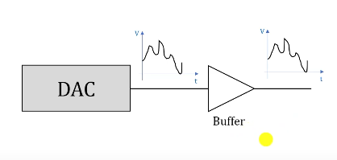

Conversores DAC (Digital Analogic Conversor) permite que o mundo digital possa se comunicar com o mundo real, dentre os exemplos que nós temos são: gerar sons, controlar motores ou emitir sinais analógicos em instrumentos de medição.

 -  Uma aplicação de DAC está em alto falantes. Os arquivos de música digitais do smartphone são convertidos para analógico e em seguida são reproduzidos pelos alto falantes.

---

O STM32 apresenta dois conversores DAC, chamados de **DAC1** e **DAC2**, ligados ao barramento **APB1**. Normalmente eles são usados para reprodução de áudio e por isso existem dois, um para o canal left e outro para o canal right.

> ~={green}Circuito DAC=~

<div align="center"></div>

Um conversor digital analógico é um circuito que transforma um número digital de entrada com precisão finita de N bits em uma tensão analógica de saída linearmente proporcional ao código de entrada.

-  N - quantidade de bits da conversão (12 bits);
-  2^N - quantidade de níveis de tensão analógica na saída (4096 níveis) - de 0 à 4095;
-  Resolução = (faixa de tensão de saída) / (2^N - 1)  (805,86 microVolts).

Em relação a resolução, ela basicamente é o passo ou também conhecida como incremento/decremento do código e consequentemente da tensão analógica. Ou seja, a resolução é a variação mínima que conseguimos obter na tensão de saída quando variamos o código de entrada em uma unidade.

<mark style="background: #FF5582A6;">Obs</mark>

A faixa de tensão de saída é até onde vai a tensão do microcontrolador, no nosso caso vai de 0V até 3.3V. Aplicando esse valor a fórmula da resolução obtemos os 805,86 microVolts.

<div align="center"></div>

Lembrando que a reta não é totalmente "certinha" ela é formada por "degraus" que a cada um deles aumenta no valor da resolução do microcontrolador até o máximo.

---

Uma sequência de códigos digitais ao longo do tempo nos possibilita a criação de formas de onda analógica na saída, e é dessa maneira que o áudio é gerado e reproduzido no altofalante do celular.

<div align="center"></div>

-  Cada um dos códigos que vão fazer parte da formação da onda são chamados de **AMOSTRAS DIGITAIS**.
-  Para melhorar a onda senoidal gerada pelas amostras digitais nós podemos conectar filtros analógicos na saída do conversor DAC.

> ~={green}Exemplo da Implementação em Hardware de um conversor DAC com 4 bits de entrada.=~

Existem diversas formas de implementar um circuito DAC. Na figura há um exemplo de circuito DAC construído a partir de um circuito somador-inversor baseado em amplificador operacional.

<div align="center">

</div>

-  O dado que será convertido é escrito em DATA REGISTER (D3 mais significativo);
-  Se um bit é 0 a chave é aberta, se for 1 a chave é fechada;
-  As chaves são transistores e a tensão de saída é dada na imagem que é equivalente a que vimos anteriormente (já que os Ds só podem ser 0s ou 1s).
###### <span style="color:rgb(4, 255, 0)">Características dos conversores DAC do STM32</span>

-  Existem dois conversores de 12 bits DAC1 e DAC2;
-  Resolução configurável de 8 ou 12 bits (range de saída de 0 até 3.3V);
-  Modos de conversão independente ou simultâneo (Operação dupla com os dois conversores);
-  Possibilidade de operação com periférico DMA (Não passa pelo processador);
-  Geração automatizada de formas de ondas (Formas onda triangulares e de ruído).
-  Os sinais de saída dos conversores são roteados/deslocados até o módulo **GPIOA** nos pinos **PA4** e **PA5** e esses pinos devem ser configurados no **MODO ANALÓGICO**.
-  Cada DAC possui um *buffer* de saída que pode ser habilitado ou não. O buffer é um circuito que recebe a tensão do DAC e reproduz essa mesma tensão na saída, porém a saída do buffer possui uma maior capacidade de fornecer corrente (UTILIZADO PARA LIGAR LEDS, por exemplo);
-  O buffer garante uma baixa impedância de saída para permitir uma fornecimento maior de corrente, (A impedância do DAC puro é mais alta).

<div align="center"></div>

> ~={green}Ok, mas e como se faz para utilizar o DAC no STM32F407 ?

Segue o passo a passo  😉

-  O pino de saída correspondente, PA4 ou PA5, deve ser configurado no modo analógico;

-  O clock do módulo DAC deve ser ligado por meio do bit **DACEN** (Digital Analogic Conversor Enable) do registrador **APB1ENR** no módulo **RCC**;

<div align="center"></div>
*Esse registrador habilita o clock dos periféricos que estão conectados a ele, no nosso caso o bit 29.*

-  Cada canal é ligado setando o bit **EN** correspondente no registrador **CR** (Control Register) do módulo DAC;

<div align="center"></div>

-  Os buffers analógicos de saída podem ser ativados ou desativados usando o bit **BOFFx** correspondente no registrador **CR** do módulo DAC (Iniciam ligados, para desligar, setar o bit);

-  Para converter o valor digital para analógico, basta escrever dado no registrador de saída do DAC que a conversão é feita automaticamente.

-  Cada um dos canais do DAC possui três registradores de saída DHR - Data Holding Register. Quando somente um canal é usado, existem três possibilidades.

<div align="center"></div>
	*Alinhamento para Canal Simples*

1. Se a resolução desejada for de 8 bits, então os 8 bits devem ser escritos alinhados à direita no registador DHR8Rx (com x sendo 1 ou 2 a depender do canal).
2. Se a resolução desejada for de 12 bits, temos duas opções, os bits alinhados a esquerda, ou a direita. Nesse caso os registradores usados vão ser os DHR12Lx ou DHR12Rx (com x sendo 1 ou 2 a depender do canal).

<div align="center"></div>
	*Alinhamento para Canal Duplo*

1. Nesse caso, para que a conversão ocorra simultaneamento nos dois DACs os dois dados devem ser escritos de uma única vez e isso só é possível se usarmos os outros registradores que constam na imagem acima.

	1. DHR8RD - Data Holding Register 8bits Right Dual
	2. DHR12LD -Data Holding Register 12bits Left Dual
	3. DHR12RD - Data Holding Register 12bits Right Dual

<mark style="background: #FF5582A6;">Obs</mark>

Assim que o valor é escrito no registrador de dados, a conversão se inicia imediamente, porém, podemos gatilhar (trigger) o processo de conversão usando outros periféricos (como **TIMERS** ou comandos de software).

Iniciando o DAC pela biblioteca HAL

```C
HAL_DAC_Start(&hdac, DAC_CHANNEL_1);
// &hdac estrutura de controle que a HAL usa para gerenciar o periférico
// DAC_CHANNEL_1 é o canal escolhido;

// No laço de repetição eu uso para converter
HAL_DAC_SetValue(&hdac, DAC_CHANNEL_1, DAC_ALIGN_12B_R, valor);
```

> ~={green}Exemplo de código de conversão de valor usando DAC=~

```C
#include "main.h"
#include "Utility.h"

void setup(){

	Utility_Init(); // Inicia a biblioteca Utility
	GPIO_Clock_Enable(GPIOA); // Habilita clock do GPIOA
	GPIO_Pin_Mode(GPIOA, PIN_4, ANALOG); // Configura pino como saída analógica
	RCC->APB1ENR |= RCC_APB1ENR_DACEN; // Habilita o clock do DAC
	DAC->CR |= DAC_CR_EN1; // Habilita o canal 1 do DAC
	// Funções da biblioteca utility para DACs
	// Liga o clock e configura o pino pa4 no modo analógico
	DAC_Init(DAC_CHANNEL1);
	// Faz a conversão do valor, basta inserir o canal, o valor e a resolução.
	//DAC_SetValue(DAC_CHANNEL1, valor, DAC_RES_12BITS);
	
}

int main(){
	
	while (1){
		
		// Conversão - DAC			
		for (uint16_t valor = 0; valor <= 4095; ++valor){
			DAC->DHR12R1 = valor;
		// DAC_SetValue(DAC_CHANNEL1, valor, DAC_RES_12BITS);
			Delay_us(500);
			
	}
	
}
	return 0;	
}
```

