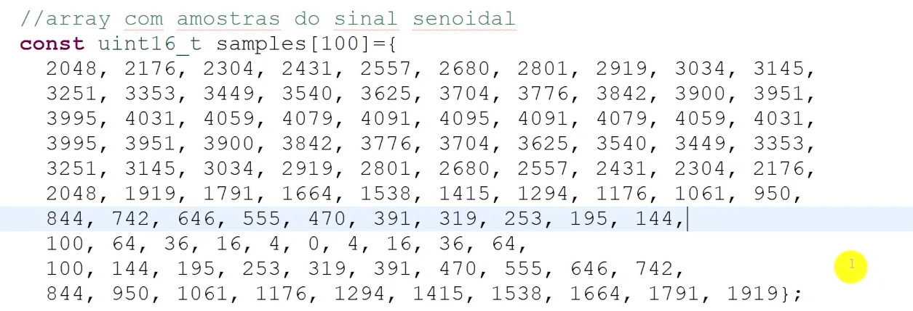

Como vimos anteriormente o DAC gera formas de onda. Nessa aula vamos abordar a capacidade da geração automática de formas de ondas e outros métodos de gatilhamento da conversão.

> ~={green}Exemplo=~

Nesse exemplo de código vamos usar o DAC para gerar uma forma de onda senoidal com uma frequência de 50 Hz no pino PA4 por meio de uma *lookup table*, que é uma tabela que armazena previamente os resultados de cálculos/mapeamentos sem que o microcontrolador precise calculá-los. A lookup table é representada pelo array samples (amostras de um ciclo de uma senoide que varia de 0 até 4095).

<div align="center"></div>

<mark style="background: #FF5582A6;">Obs</mark>

-  Os valores foram calculados previamente usando uma função senoidal para evitar que o microcontrolador realizasse o cálculo (Economiza o custo computacional);
-  Como o modificador const está no array significa que ele será **salvo** na memória flash, e não na memória ram do microcontrolador.
-  O STM possui mais memória flash do que ram.

No laço principal do programa temos o seguinte

```C
while (1){
	for (uint8_t i = 0; i<100; ++i){
		DAC_SetValue(DAC_CHANNEL1, samples[i], DAC_RES_12BITS);
		Delay_us(200);
	}
}
```

-  100 amostras a cada 200 ms, resulta um total de 20 milisegundos para cobrir todo o array. Sendo assim, o período total será de 20 milisegundos e consequentemente a frequência será de 50 Hz. 
-  Para que a frequência seja alterada, basta modificar o valor do delay.

<div align="center"></div>

Conseguimos aproximar o sinal de uma senoide real passando um filtro analógico chamado *"passa baixa"*  na saída do conversor.

> **SPOILER !!**

	Filtros passa baixa recebe um sinal e na saída fornece apenas as baixas frequências do sinal de entrada.

-  Filtro RC

<div align="center"></div>

###### <span style="color:rgb(4, 255, 0)">Geração automática de Formas de onda (triangular)</span>

A geração automática de formas de onda é util para testarmos alguns sistemas embarcados

<div align="center"></div>

No STM32 nos podemos:

-  Selecionar o tipo de onda;
-  A amplitude dela

A geração de ondas é habilitada no DAC configurando os bits **WAVE** do registrador CR do DAC.

<div align="center"></div>

E os valores possíveis para esses bits são:

-  00 - Geração automática de ondas desabilitada;
-  01 - Geração de forma de onda do tipo ruído habilitada;
-  10 ou 11 - Geração de forma de onda do tipo tringular habilitada.

Enquanto que para a amplitudade da forma de onda pode ser selecionada pelos registradores **MAMP**

O MAMP oferece até 12 opções, verifique na imagem abaixo as opções

<div align="center"></div>

<mark style="background: #FF5582A6;">Obs</mark>

Os bits de MAMP devem ser configurados antes de habilitar o DAC, pois uma vez que o DAC foi habilitado os valores dos bits não podem ser alterados.

---

> ~={green}Ok, mas como ocorre a geração automática de formas de onda triangulares?=~

Basicamente, um contador crescente/decrescente interno é atualizado toda vez que ocorre um disparo, o contador incrementa até a amplitude máxima definida pelos bits MAMP. Após atingir o valor máximo o contador é decrementado até o valor 0 e reinicia o processo.

O valor do contador é adicionado ao registrador de dados do DAC e o resultado da soma é quem vai ser convertida.

<div align="center"></div>

<mark style="background: #FF5582A6;">Obs</mark>

Para habilitar eventos de disparo nós devemos setar o bit **TEN** (Trigger Enable) e após isso selecionar o tipo do evento nos bits **TSEL** (Trigger Selection). Os dois procedimentos são feitos nos canais correspondentes.

-  Possíveis eventos de disparo

<div align="center">
<table>
<tr>
<th>000</th>
<th>Timer 6 TRGO event</th>
</tr>
<tr>
<th>001</th>
<th>Timer 8 TRGO event</th>
</tr>
<tr>
<th>010</th>
<th>Timer 7 TRGO event</th>
</tr>
<tr>
<th>011</th>
<th>Timer 5 TRGO event</th>
</tr>
<tr>
<th>100</th>
<th>Timer 2 TRGO event</th>
</tr>
<tr>
<th>101</th>
<th>Timer 4 TRGO event</th>
</tr>
<tr>
<th>110</th>
<th>External line9 (EXTI9)</th>
</tr>
<tr>
<th>111</th>
<th>Software Trigger</th>
</tr>
</table>
</div>

Para fazer o gatilhamento por softwrae nós devemos setar o bit **SWTRIG2** ou **SWTRIG1** do registrador **SWTRIGR**

<div align="center"></div>

Toda vez que setamos esse bit, o dado a ser convertido é enviado para o DAC e o sinal analógico correspondente vai aparecer no pino de saída.

> ~={green}Exemplo de código=~

```C
#include "main.h"
#include "Utility.h"
  
void setup(){
	
	// Inicia a Utility
	Utility_Init();
	GPIO_Clock_Enable(GPIOA);
	GPIO_Pin_Mode(GPIOA, PIN_5, ANALOG);
	// Habilita o barramento do DAC
	RCC->APB1ENR |= RCC_APB1ENR_DACEN;
	// Habilita a geração de onda triangular
	DAC->CR |= 0b10 << 22;
	// Escolhe a amplitude da onda de 11 bits no DAC2
	DAC->CR |= 0b1010 << 24;
	// Seleciona gatilhos por software do DAC2
	DAC->CR |= 0b111 << 19;
	// Habilita gatilhos no DAC2
	DAC->CR |= DAC_CR_TEN2;
	// Habilita o canal 2 do DAC
	DAC->CR |= DAC_CR_EN2;
}

int main(){
	while (1){
		
		DAC->SWTRIGR |= 1 << 1;	
		Delay_us(1);
	
	}
	return 0;
}
```

Abaixo, tem-se uma imagem da onda gerada pelo código acima.

<div align="center"></div>

Se quisermos deslocar a forma de onda, podemos escrever um valor no registrador de dados que ele será somado a forma de onda automaticamente.

Veja abaixo (com essa pequena mudança a onda deve deslocar em 1240 unidades. correspondendo a aproximadamente 1V).

```C
#include "main.h"
#include "Utility.h"
  
void setup(){
	
	// Inicia a Utility
	Utility_Init();
	GPIO_Clock_Enable(GPIOA);
	GPIO_Pin_Mode(GPIOA, PIN_5, ANALOG);
	// Habilita o barramento do DAC
	RCC->APB1ENR |= RCC_APB1ENR_DACEN;
	// Habilita a geração de onda triangular
	DAC->CR |= 0b10 << 22;
	// Escolhe a amplitude da onda de 11 bits no DAC2
	DAC->CR |= 0b1010 << 24;
	// Seleciona gatilhos por software do DAC2
	DAC->CR |= 0b111 << 19;
	// Habilita gatilhos no DAC2
	DAC->CR |= DAC_CR_TEN2;
	// Habilita o canal 2 do DAC
	DAC->CR |= DAC_CR_EN2;
	
	// Somando um valor
	DAC->DHR12R2 = 1240;  // offset
}

int main(){
	while (1){
		
		DAC->SWTRIGR |= 1 << 1;	
		Delay_us(1);
	
	}
	return 0;
}
```

> ~={green}Onda Triangular Gerada=~

<div align=""></div>

###### <span style="color:rgb(4, 255, 0)">Geração de Formas de onda (ruído)</span> 

Nesse tipo de geração de forma de onda, o microcontrolador usa um registrador de deslocamento com realimentação linear, chamado **LFSR** (Linear Feedback Shift Register). Lembrando que é **pseudoaleatório**

<div align="center"></div>

E para gerar um sinal de ruído, basta substituir na biblioteca utility o valor do tipo de onda triangular por noise.

```C
#include "main.h"
#include "Utility.h"

void setup(){

	// Inicia a Utility

	Utility_Init();
	GPIO_Clock_Enable(GPIOA);
	GPIO_Pin_Mode(GPIOA, PIN_5, ANALOG);
	// Habilita o barramento do DAc
	RCC->APB1ENR |= RCC_APB1ENR_DACEN;
	// Habilita a geração de onda triangular
	DAC->CR |= 0b10 << 22;
	// Escolhe a amplitude da onda de 11 bits no DAC2
	DAC->CR |= 0b1010 << 24;
	// Seleciona gatilhos por software do DAC2
	DAC->CR |= 0b111 << 19;
	// Habilita gatilhos no DAC2
	DAC->CR |= DAC_CR_TEN2;
	// Habilita o canal 2 do DAC
	DAC->CR |= DAC_CR_EN2;
	// Usando a Utilit para geração de ondas triangulares
	// DAC_Init(DAC_CHANNEL2, AUTO_TRIANGLE, AMP_11BITS); (AUTO_NOISE)
	// DAC_SWTrigger(DAC_CHANNEL2); (USAR NO LOOP)
	// Se quisermos somar um valor, usamos DAC_SetValue
}

int main(){

	while (1){
		DAC->SWTRIGR |= 1 << 1;
		Delay_us(1);
		// DAC_SWTrigger(DAC_CHANNEL2);
	}
	return 0;
}
```

---

Por fim, outras tópicos que podem ser estudados mais para frente são: 

-  Uso de timers como gatilhamentos;
-  DMA para o registrador DHR

<div align="center"></div>
