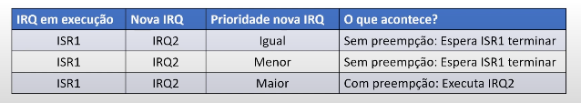

No STM32 a prioridade no atendimento de interrupções é gertenciada pelo NVIC. A prioridade define quais interrupções são mais importantes e quais podem "interferir" em outras.

A função quedefine a prioridade de uma interrupção é dada pela seguinte linha de código

```C
NVIC_SetPriority(IRQn_Type IRQN, uint32_t priority);
```

-  Quanto menor o número maior será a prioridade de execução do tratamento de interrupção.

> ~={green}Exemplo prático=~

<div align="center"></div>

-  PA2 vai ser configurado como saída digital e vai fornecer o sinal simultaneamente para PA1 e PA0 que vão ser entradas. 
-  Como estou trabalhando com as entradas A1 e A0 então para usar as interrupções associadas eu vou precisar de EXTI0 e EXTI1. 
-  PA6 e PA7 vão ser as saídas que estão interligadas aos LEDs da placa. 
-  As interrupções vãos er configuradas para serem gatilhadas na borda de subida. 
-  Sempre que ocorrer uma borda de subida as rotinas de tratamento de interrupções IRQHandler de EXTI0 e EXTI1 vão ser chamadas.

Após realizar a montage, aparentemente, PA1 e PA0 estão ligando ao mesmo tempo, entrentanto, <mark style="background: #FF5582A6;">NÃO ESTÃO</mark>!! 

Um deles está ligando primeiro, pois uma das ISRs está sendo executada primeiro e o nosso microcontrolador só possui um núcleo, ou seja, ele não pode executar duas funções ao mesmo tempo. 

Quando inserimos um delay de 500 ms nas ISRs percebemos que a ISR que liga o LED D2 acende primeiro. Mas porque isso ocorre?

> Isso ocorre pois não explicitamos nenhuma prioridade para as ISRs. Dessa forma, ambas estão rodando com a prioridade máxima.

Se as ISRs estiverem setadas com a mesma prioridade, a escolha da primeira a ser executada será a partir da númeração definida pela CMSIS. Por esse motivo a ISR do LED D2 é executada primeiro pois tem menor número 6 (EXTI0) e a (EXTI1) tem numeração 7.

Para alterar a prioridade nós devemos configurar isso após o NVIC

```C
NVIC_SetPriority(EXTI0_IRQn, 1);
NVIC_SetPriority(EXTI1_IRQn, 0);
```

Para facilitar a visualização podemos colocar os 500ms nas ISRs.

Em relação a preempção de interrupções temos a seguinte tabela de prioridades.

<div align="center"></div>


> ~={green}Exemplo prático 2=~

<div align="center"></div>

-  Configurar PE3 e PE4 como entradas das interrupções EXTI3 e EXTI4;
-  Quado K1 for pressionado, a EXTI3 será executada. Nela o LED D2 irá acender, esperar um tempo e depois desligar novamente.
-  O mesmo ocorre com K0 a EXTI4 será executada. Nela o LED D3 é aceso, espera um tempo e depois ele será desligado. 
-  Durante o tempo que um dos LEDs estiverem esperando para apagar, outro botãos será acionado para que possamos ver a preempção. 

<mark style="background: #FF5582A6;">Obs</mark>

Para fazer o atraso nas ISRs foi usado o decremento de uma variável, pois as funções de delay usam o periférico TIMER para produzir um atraso temporizado. Se ocorre uma interrupção de uma interrupção (preempção) também vai haver um delay e isso vai fazer com que o tempo seja desconfigurado na primeira ISR, já que ambas as funções usam o mesmo TIMER. 

```C
#include "main.h"
#include "Utility.h"

void EXTI3_IRQHandler(){
	GPIO_Write_Pin(GPIOA, PIN_6, LOW);
	for (int i = 30000000; i; --i);
	GPIO_Write_Pin(GPIOA, PIN_6, HIGH);
	EXTI_Clear_Pending(EXTI3);
}

void EXTI4_IRQHandler(){
	GPIO_Write_Pin(GPIOA, PIN_7, LOW);
	for (int j = 30000000; j; --j);
	GPIO_Write_Pin(GPIOA, PIN_7, HIGH);
	EXTI_Clear_Pending(EXTI4);
}

void setup(){

	Utility_Init(); // Inicializa a biblioteca utility
	GPIO_Clock_Enable(GPIOA); // Ativa o clock do GPIOA
	GPIO_Clock_Enable(GPIOE); // Ativa o clock do GPIOE
	// Coloca ambos os LEDs em nivel alto
	GPIO_Write_Pin(GPIOA, PIN_6, HIGH);
	GPIO_Write_Pin(GPIOA, PIN_7, HIGH);
	// Configuração de botões e leds
	GPIO_Pin_Mode(GPIOA, PIN_6, OUTPUT);
	GPIO_Pin_Mode(GPIOA, PIN_7, OUTPUT);
	GPIO_Pin_Mode(GPIOA, PIN_3, INPUT);
	GPIO_Pin_Mode(GPIOA, PIN_4, INPUT);
	// Habilitando resistores
	GPIO_Resistor_Enable(GPIOE, PIN_3, PULL_UP);
	GPIO_Resistor_Enable(GPIOE, PIN_4, PULL_UP);
	EXTI_Config(EXTI3, GPIOE, FALLING_EDGE);
	EXTI_Config(EXTI4, GPIOE, FALLING_EDGE);
	NVIC_EnableIRQ(EXTI3_IRQn);
	NVIC_EnableIRQ(EXTI4_IRQn);
	NVIC_SetPriority(EXTI3_IRQn, 1);
	NVIC_SetPriority(EXTI4_IRQn, 0);
}

int main(){
	
	setup();
	while(1){
		GPIO_Toggle_Pin(GPIOA, PIN_2);
		Delay_ms(1000);
	}
	return 0;
}
```

