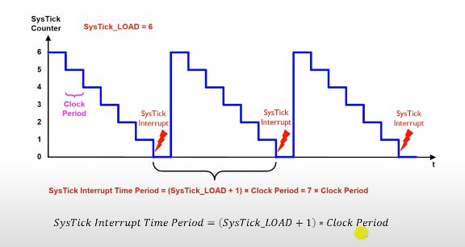

Vamos começar a estudar como os microcontroladores trabalham com a temporização de eventos. O tempo é uma grandeza fundamental no controle de sistemas embarcados. 

Os Timers operam de forma autonama, paralela à CPU permitindo maior precisão e eficiência no processamento de tarefas temporais.

---

> ~={green}Ok, mas o que são Timers?=~

Timers são fundamentalmente um contador cujo conteúdo é incrementado ou decrementado a cada pulso de entrada. Se os pulsos possuirem uma frequência fixa, contar os pulsos vira uma contagem de tempo (**Temporização**).

> ~={green}Exemplo com medição de tempo=~

<div align="center"></div>

-  \[uS\] - sendo o período de oscilação dos pulsos;
-  Quando o oscilador funciona à 1 MHz o contador é incrementado a cada 1 micro segundos;
-  E o tempo de A até B seria de (B-A * 1 micro segundo).

<mark style="background: #FF5582A6;">Obs</mark>

Timers servem para contar pulsos de entrada que não possuem frequência fixa. Sendo assim, o circuito pode operar na forma de contador ou de timer.

---

Em relação aos registradores dos Timers além do que armazena o valor da contagem, existem registradores associados. 

<div align="center"></div>

Esses registradores podem ser usados para:

-  Controlar a operação;
-  Os modos de contagem;
-  Indicar o status das operações.

O primeiro registrador que estamos vendo, o Registrador de Controle, possui bits de configuração do Timer.

1. Modo de Contagem (crescente ou decrescente);
2. Seleção da fonte dos pulsos de contagem/clock;
3. Iniciar ou parar a contagem;
4. Habilitar interrupções quando a contagem atingir um determinado valor;
5. Resetar a contagem

Além disso, um Timer pode ter qualquer quantidade de bits no registrador de contagem e esse registrador é o principal bloco, é ele quem recebe os pulsos e faz o incremento ou decremento automaticamente.

<mark style="background: #FF5582A6;">Obs</mark>

Normalmente esse registrador tem 8, 12, 16, 24 ou 32 bits no STM32F407. (Timers de 8 bits podem contar até 2^8, 256 pulsos de entrada e assim por diante...).

> ~={green}Mas o que acontece se o valor limite for ultrapassado?=~

Isso é fácil, quando o timer passa do valor limite ele é automaticamente reiniciado. Sendo assim, se estamos contando com 8 bits, então temos 256 números diferentes com a contagem indo de 0 até 255. Quando formos para 256 o timer vai voltar para o 0. 

Essa "ultrapassagem" é chamada de estouro do timer, ou **OVERFLOW**.

Se ocorrer o contrário, com uma contagem decrescente o valor do timer retorna para o valor máximo, nisso nós teremos um **UNDERFLOW**.

Essas situações são normalmente sinalizadas pelo registrador de status e elas podem gerar interrupções.

---

> ~={green}Beleza Josué, mas o microcontrolador trabalha muito rápido e num instante o valor máximo é alcançado, o que fazemos para consertar isso?=~

Isso é verdade, facilmente o valor máximo (crescente) ou mínimo (decrescente) é alcançando. Para que consigamos forçar uma "desaceleração" no timer nós precisamos usar um *prescaler* que vai ser um divisor de frequência do clock de entrada.

-  Conseguimos configurar o prescaler para "desacelerar" e diminuir a frequência;
-  Times podem fornecer sinais períodos de interrupções para conversores DAC e ADC;
-  Outra aplicação de Timers é a geração de formas de onda PWM.

O STM32F407 possui diversos Timers, nomeados de TIM1 até o TIM14, alguns sendo de 32 bits e outros de 16. Entretanto, existem Timers dedicados de 24, 12 e 7 bits.

<div align="center"></div>

-  Os Timers **TIM1** e **TIM8** são usados para gerar sinais **PWM trifásicos**. Esse tipo de Timer é usado para aplicações que envolvem motores trifásicos industriais, inversores fotovoltaicos, nobreaks trifásicos, motores de carro elétrico e são os timers mais completos;

-  Os Timers **TIM2**, **5**, **3**, **4**, **9**, **10**, **11**, **12**, **13** e **14** são de uso geral, ou seja, podem ser usados para geração de base de tempo, contagem de tempo, criação de sinais PWM individuais, leitura de sensores como encoders (sensores de velocidade e posição do eixo de motores);

-  Os Timers **TIM6** e **TIM7** são básicos e utilizados para criação de gatilhos para o DAC, além disso, podem ser usados como base de tempo genérica de 16 bits.

---

Além desses Timers, o STM32F407 possui mais três timers específicos

-  Timer cão de guarda independente (Independent Watchdog - IWDG) - 12 bits;

	-  Usa o clock independente do clock do sistema;
	-  Usado para resetar o microcontrolador quando ocorrer travamento de software;

-  Timer cão de guarda de janela (Window Watchdog - WWDG) - 7 bits;

	-  Alimentado pelo clock principal do sistema;
	-  Usado para resetar o microcontrolador quando ocorrer travamento de software;

-  Timer do sistema (SysTick) - 24 bits.

	-  Dedicado para ser usado em sistemas operacionais;
	-  Gera interrupções em intervalos programáveis.

*Se nenhum dos Timers estiver sendo usado para seu objetivo padrão, nós podemos usar eles como timers normais.*

<div align="center"></div>

-  Usado em SO para verificar se o Kernel está acessível;
-  O timer está integrado no controlador NVIC (pode gerar exceção do sistema).


<div align="center"></div>

<div align="center"></div>

<div align="center"></div>

>~={green} Exemplo Prático com o SysTick=~

<div align="center"></div>


-  Vamos configurar PA6 e PA7 como saídas digitais;
-  PA6 vamos ligar e desligar a cada 1 segundo (vamos usar delay_ms da utility);
-  PA7 vamos fazer o led ligar e desligar a cada 300 mili segundos (aqui nós vamos fazer com timers, nesse caso o SysTick);
-  Na ISR do SysTick vamos fazer a alternância do estado do LED de PA7.

> ~={green}Código=~

```C
#include "main.h"
#include "Utility.h"

void SysTick_Handler(){
	GPIO_Toggle_Pin(GPIOA, PIN_7);
}

int main(){
	
	Utility_Init();
	GPIO_Clock_Enable(GPIOA);
	GPIO_Pin_Mode(GPIOA, PIN_6, OUTPUT);
	GPIO_Pin_Mode(GPIOA, PIN_7, OUTPUT);
	SysTick->LOAD = 6.3e6 - 1; // Carrega o registrador Reload Value
	SysTick->CTRL = 0b011; // Liga o SysTick, habilita a interrupção e seleciona
	while(1){
		
		GPIO_Toggle_Pin(GPIOA, PIN_6);
		Delay_ms(1000);
		
	}
	return 0;
	
}
```

-  Para desacelerar o clock, vamos usar a fonte de clock AHB de 168 MHz / 8 que resulta em 21 MHz;
-  Para que a contagem dure 300 milisegundos com pulsos na frequência de 21 MHz é necessário contar até 6.3 milhões menos 1.

		Esse valor foi encontrado 300 milisegundos pelo período do sinal de clock de 21 MHz e subtrair um 1, já que o período das interrupções do SysTick é sempre o valor do registrador load + 1.

<mark style="background: #FF5582A6;">Obs</mark>

Quando compilamos o código (exclusivamente para o SysTick) o timer meio que já vem configurado, então vai dar um erro de múltiplas definições de funções. Para resolver isso, basta comentar a função SysTick que vem com a biblioteca HAL e deixaremos apenas a que escrevemos.
(O nome do arquivo que essa função está é o *stm32f4xx_it.c*).

<mark style="background: #FF5582A6;">Obs 2</mark>

Ao fazer o que fizemos, não podemos mais utilizar a função **HAL_Delay**, pois desconfiguramos o que a biblioteca HAL faz com o timer SysTick. Entretanto, podemos usar a função Delay_ms da Utilty que nesse caso, usa o Timer TIM2.

